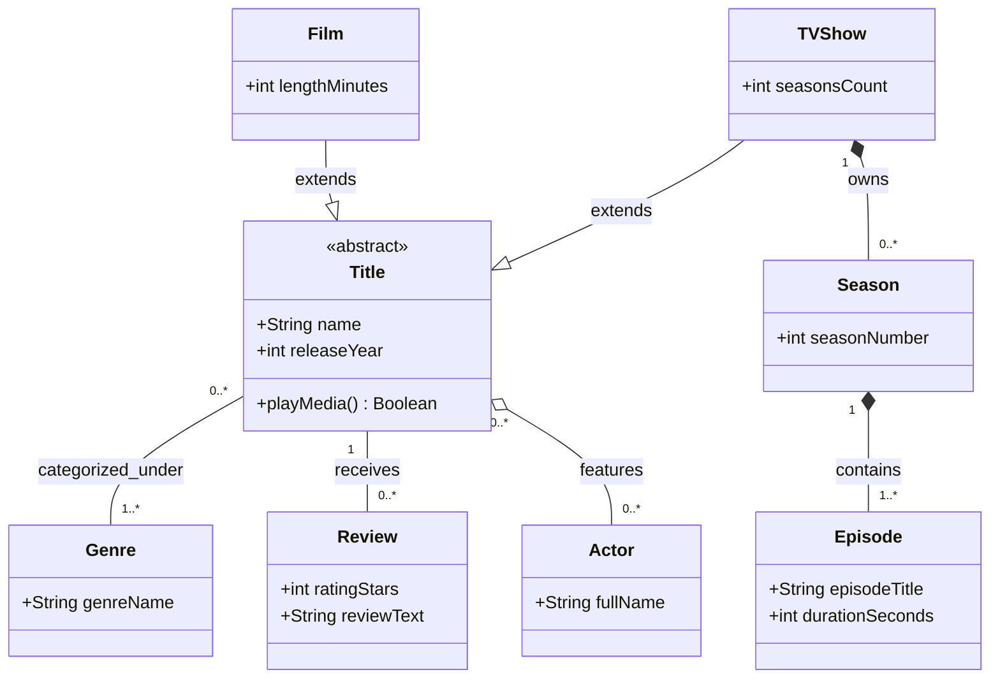

```mermaid
classDiagram
direction TB
title Streamy Production Structural Domain Model
class Title {
<<abstract>>
+String name
+int releaseYear
+playMedia() Boolean
}
class Film {
+int lengthMinutes
}
class TVShow {
+int seasonsCount
}
class Season {
+int seasonNumber
}
class Episode {
+String episodeTitle
+int durationSeconds
}
class Review {
+int ratingStars
+String reviewText
}
class Actor {
+String fullName
}
class Genre {
+String genreName
}
Title "0..*" -- "1..*" Genre : categorized_under
TVShow "1" *-- "0..*" Season : owns
Title "1" -- "0..*" Review : receives
Season "1" *-- "1..*" Episode : contains
Title "0..*" o-- "0..*" Actor : features
Film --|> Title : extends
TVShow --|> Title : extends
```
